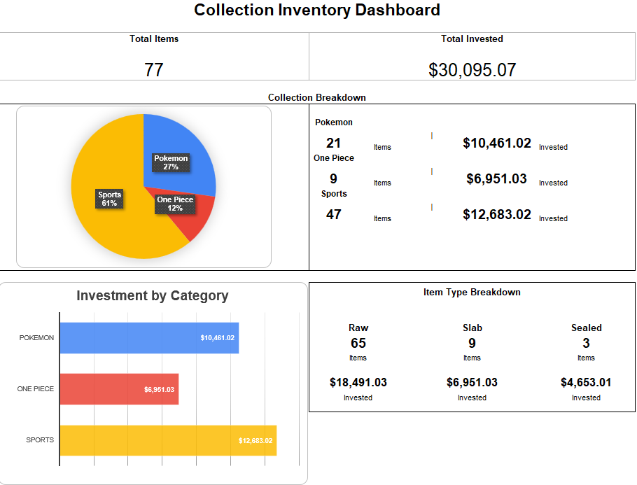

# TCG Collection Inventory Dashboard

An Excel-based inventory and analytics tool designed to help trading card collectors organize, track, and analyze their collections.

The workbook tracks collection quantities, investment amounts, item types, and category breakdowns while automatically summarizing the data through a dynamic Excel dashboard.

## Dashboard Preview

> **Note:** The demo workbook uses fictional sample data created for testing and portfolio demonstration purposes.

## Project Features

- Tracks Pokémon, One Piece, and Sports collectibles
- Supports Raw Cards, Slabs, and Sealed Products
- Calculates total items and total investment
- Breaks down collection size by category
- Analyzes investment by category
- Summarizes inventory by item type
- Automatically updates dashboard metrics as inventory data changes
- Includes a blank reusable template and a populated demonstration workbook

## Files

[**TCG_Collection_Inventory_Demo.xlsx**](TCG_Collection_Inventory_Demo.xlsx)  
Populated workbook using fictional sample data to demonstrate the dashboard and analytical features.

[**TCG_Collection_Inventory_Template.xlsx**](TCG_Collection_Inventory_Template.xlsx)  
Blank reusable version of the collection inventory system.

## Tools & Skills Demonstrated

- Microsoft Excel
- Spreadsheet design
- Excel formulas
- Data organization
- Data analysis
- KPI development
- Dashboard design
- Data visualization
- Inventory tracking

